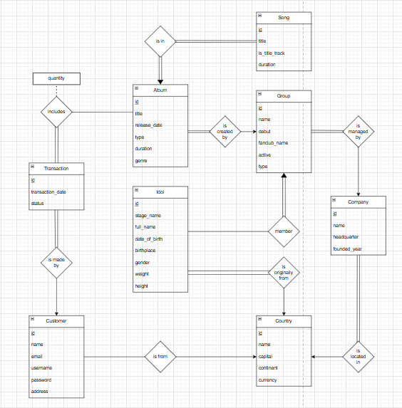
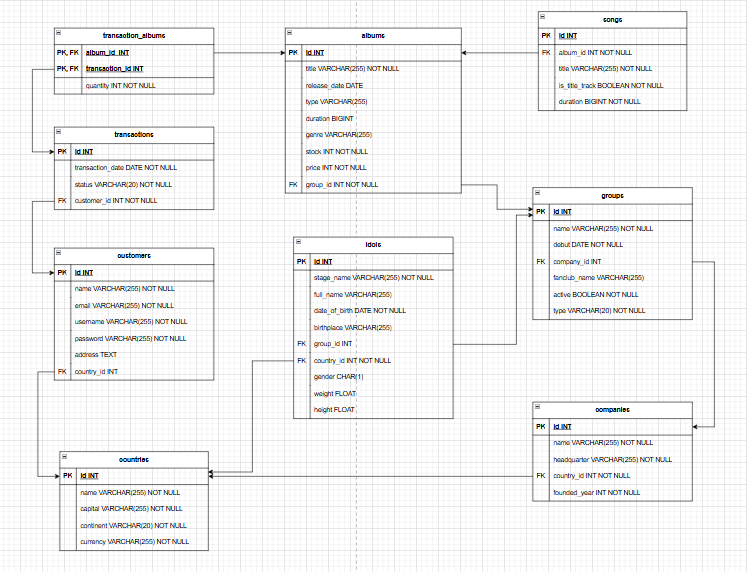
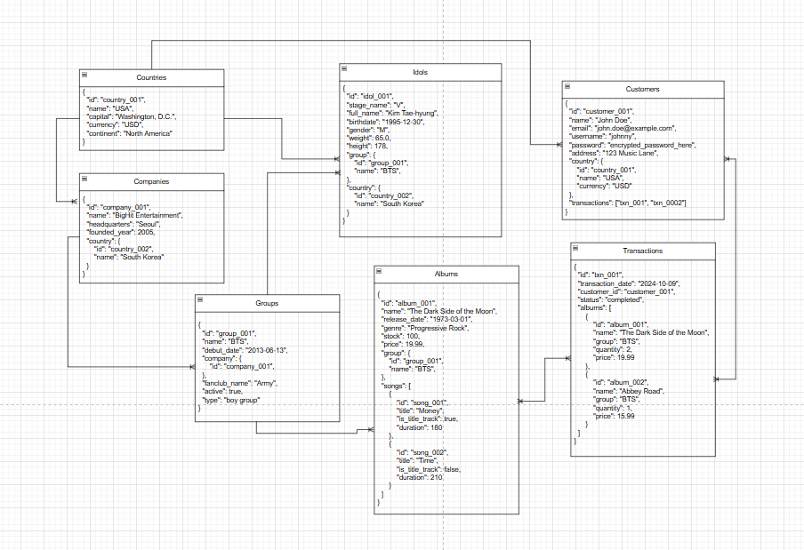
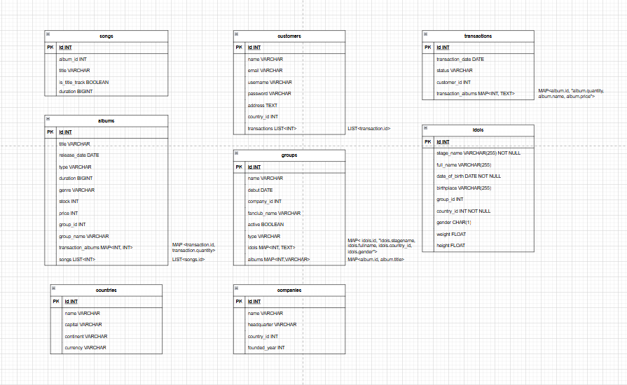

# TUGAS BESAR Relational DBMS vs DNo-SQL DBMS - IF4040

## Table of Contents
* [Milestone Pengerjaan](#milestone-pengerjaan)
* [Deskripsi Singkat](#deskripsi-singkat)
* [Detail Data](#detail-data)
* [Diagram Data](#diagram-data)
* [Anggota Kelompok](#anggota-kelompok)
* [Referensi](#referensi)

## Milestone Pengerjaan
* **Tugas 1: Relational DBMS vs Document No-SQL DBMS**
* **Tugas 2: Relational DBMS vs Column-based No-SQL DBMS**

## Deskripsi Singkat 
Program ini dibuat untuk melakukan analisis perbandingan kinerja DBMS Relasional, dalam hal ini PostgreSQL, dengan No SQL Database. Analisis dilakukan dengan menggunakan 5 query read dan 5 query manipulasi (Insert, Update, Delete)

## Detail Data

### Full Data
| No. | Nama Relasi/ Tabel |Jumlah Data |
|-----|--------------------|------------|
| 1 | Albums | 500.203 rows | 
| 2 | Companies | 501.125 rows |
| 3 | Countries | 195 rows | 
| 4 | Customers | 500.000 rows | 
| 5 | Groups | 500.447 rows | 
| 6 | Idols | 501.945 rows | 
| 7 | Songs | 500.961 rows | 
| 8 | Transaction_albums | 5.000.000 rows |
| 9 | Transactions | 2.000.000 rows |

### Sampled Data
| No. | Nama Relasi/ Tabel |Jumlah Data |
|-----|--------------------|------------|
| 1 | Albums | 49.892 rows | 
| 2 | Companies | 50.000 rows |
| 3 | Countries | 195 rows | 
| 4 | Customers | 50.000 rows | 
| 5 | Groups | 48.796 rows | 
| 6 | Idols | 50.000 rows | 
| 7 | Songs | 50.000 rows | 
| 8 | Transaction_albums | 12.446 rows |
| 9 | Transactions | 50.000 rows |

## Diagram Data

### ERD (*Entity Relationship Diagram*)

### Diagram Relasional

### Visualisasi Document DBMS

### Visualisasi Column-Based DBMS 

## Anggota Kelompok
<table>
    <tr>
        <td>No.</td>
        <td>Nama</td>
        <td>NIM</td>
    </tr>
    <tr>
        <td>1.</td>
        <td>Louis Caesa Kusuma</td>
        <td>13521069</td>
    </tr>
    <tr>
        <td>2.</td>
        <td>Alexander Jason</td>
        <td>13521100</td>
    </tr>
    <tr>
        <td>3.</td>
        <td>Juan Christopher Santoso</td>
        <td>13521116</td>
    </tr>
</table>

## Referensi
* [Google Drive](https://drive.google.com/drive/u/0/folders/1sHOpGPVtIi7grO8wdq9m345S4rVI66i-)
* [Dokumentasi Google Docs - Tugas 1](https://docs.google.com/document/d/1XbbRzJC3lsLeF3C5nAoOXkIe-h2oPwyoNWRdtbm43us/edit?tab=t.0)
* [Dokumentasi Google Slides - Tugas 1](https://docs.google.com/presentation/d/1m3-1Wq5wlQHsEwnU6MK63e94_mIaHdBp744wXB1g90U/edit#slide=id.gd206afaa83_0_0)
* [Dokumentasi Google Docs - Tugas 2](https://docs.google.com/document/d/1WQQjjf_0xcKQbbzVs3hRO1secPBNqwMJqXlMmgwZ1YQ/edit?tab=t.0)
* [Dokumentasi Google Slides - Tugas 2](https://docs.google.com/presentation/d/1gJfj0eoN3zyVl5pNsr8LSdivDjTMWnpyIG6-f4AmHzA/edit#slide=id.gd206afaa83_0_0)